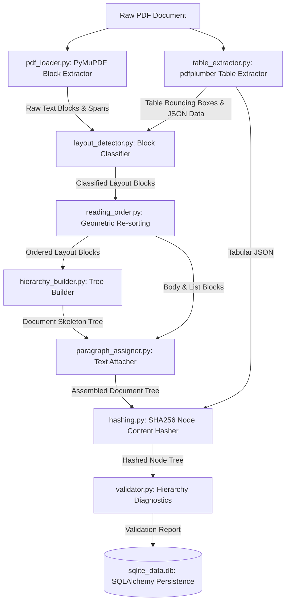
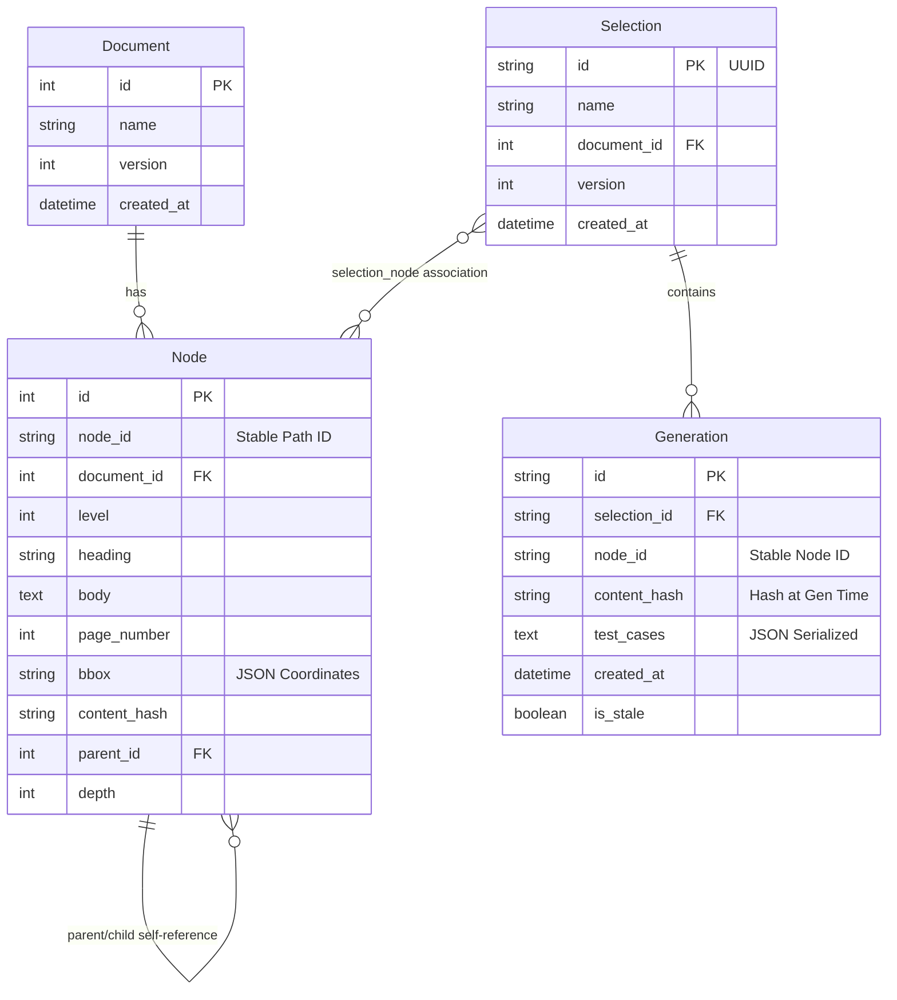

# System Architecture & Technical Design

This document details the software design, parsing heuristics, data models, and complexities of the CardioTrack CT-200 Document Parser & QA Traceability API.

---

## 1. Pipeline Diagram

The flowchart below shows the step-by-step progression of a PDF document as it goes through the parser pipeline and is saved to the SQLite database.

---

## 2. Class & Database Diagram

This diagram displays our database entities (SQLAlchemy models) and their relational connections.

---

## 3. Module Responsibilities

| Module | Responsibility |
| :--- | :--- |
| `pdf_loader.py` | Loads PDF pages via PyMuPDF; extracts text blocks with span-level metadata (fonts, sizes, colors, weights, coordinates) and assigns unique global block IDs. |
| `layout_detector.py` | Classifies raw blocks into Title, Heading, Paragraph, List, Table, Image, Caption, and Header/Footer using spatial overlap rules and text heuristics. |
| `reading_order.py` | Performs geometric re-sorting on page blocks. Clusters blocks into visual line rows based on vertical overlap, then sorts each row left-to-right (X-axis). |
| `heading_detector.py` | Normalizes heading levels (0=Title, 1=H1, 2=H2, 3=H3, 4=H4) using regular expressions (e.g. `^\d+\.\d+`) and font sizes, resolving style inconsistencies. |
| `hierarchy_builder.py` | Builds the document tree skeleton from heading blocks, assigning hierarchical stable IDs like `sec_1_1` based on numbering path. Generates a fallback root if a title block is missing. |
| `paragraph_assigner.py` | Loops through reading-order blocks, attaching body paragraphs, list blocks, and tables to the nearest preceding heading node. Catches orphan text block anomalies. |
| `table_extractor.py` | Uses `pdfplumber` to isolate tables, resolve grid cell spans, merge cells, and serialize tables into a structured JSON schema `{headers, rows}`. |
| `image_extractor.py` | Extracts raster images to the output folder and pairs them with nearby caption blocks by measuring vertical distance. |
| `hashing.py` | Normalizes whitespaces and computes a SHA256 content hash of `heading + body` (including serialized tables) for change tracking. |
| `validator.py` | Audits the document tree structure, reporting duplicates, gaps in number sequences, or missing parent relationships. |
| `repository.py` | Database data access layer. Implements version mapping, selection version pinning, selection staleness auditing, and unified diff generations. |

---

## 4. Complexity Analysis

### Time Complexity
* **PDF Parsing (PyMuPDF + pdfplumber)**: $\mathcal{O}(P \cdot (B \log B + T))$ where $P$ is page count, $B$ is text blocks per page, and $T$ is table detection complexity. pdfplumber uses line intersection matrices, which are highly efficient.
* **Layout Classification & Reading Order**: $\mathcal{O}(B \log B)$ per page due to sorting blocks by coordinates.
* **Tree Building & Paragraph Assignment**: $\mathcal{O}(N)$ where $N$ is total blocks in the document. We use a stack traversal for the tree skeleton and a single pass for paragraph assignment.
* **Staleness Auditing**: $\mathcal{O}(S)$ where $S$ is the number of nodes in a selection. The SQL lookup for the latest document version node is indexed on `(document_id, node_id)`.

### Space Complexity
* **In-memory Tree Representation**: $\mathcal{O}(N)$ to store block properties and node configurations.
* **Database Size**: $\mathcal{O}(N)$ where nodes store serialized bodies. A single SQLite table easily processes large documents (SQLite handles gigabytes easily; CT-200 manuals occupy ~50KB per version in SQLite).

---

## 5. Key Design Decisions

1. **Stable ID Generation (Path-Based)**: Instead of random UUIDs, node IDs are determined by their section path (e.g. `sec_2_1_1_1`). This ensures that if version 2 updates the text of section `2.1.1.1` but retains its numbering structure, the database matches it to the logical entity in version 1. This is critical for computing version history and showing differences.
2. **Tabular Data Hashing**: Table cells extracted by pdfplumber are converted into a JSON string and attached directly to the parent section node's body text block. This ensures table contents are searchable and that any changes to cells immediately alter the node's `content_hash`, correctly flagging associated test cases as stale.
3. **Robust LLM Error Handling**: When generating test cases, the API leverages Gemini's Structured Output (`response_mime_type="application/json"`) to force JSON compliance. It includes a 3-pass retry loop in `generate-qa` to handle transit failures or parser exceptions. If the LLM connection fails or is offline, the API falls back to a content-aware mocked engine that produces highly realistic test cases based on the selected sections.

---

## 6. Limitations & Future Improvements

1. **Complex Multi-Column Flows**: For multi-column newspaper layouts, a simple vertical overlap line-band sort can fail if columns span the whole page height. Future iterations should implement structural column division using horizontal bounding gaps.
2. **Text Block Merging**: The layout detector groups spans by PyMuPDF blocks. If the PDF generator exports text fragments as individual sparse blocks, the reading order reconstruction must merge lines using dynamic spatial clustering.
3. **Auto-regeneration**: Currently, stale test cases are flagged but not modified. Adding an agentic loop to automatically rewrite test cases based on diff summaries (e.g. modifying a cycle count from 300 to 250 in a test step) would fully close the traceability loop.
